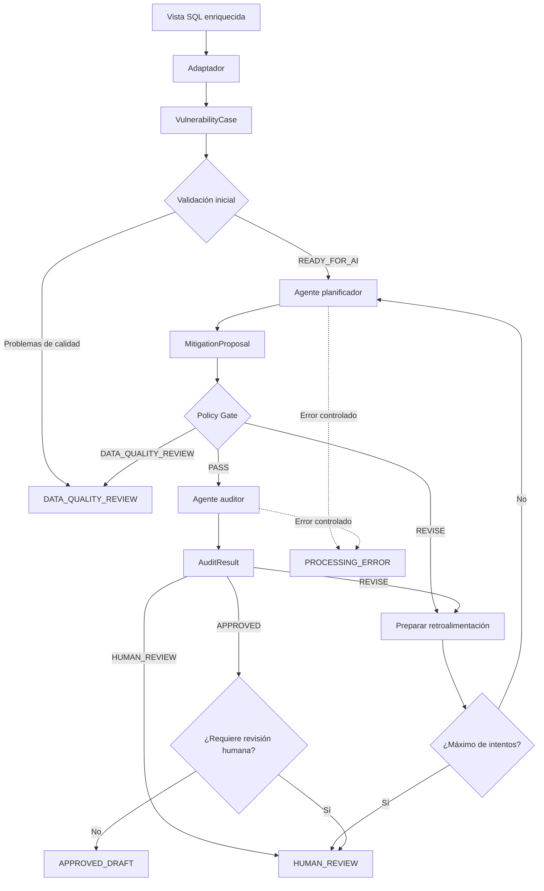

# Sistema multiagente para gestión de vulnerabilidades

MVP desarrollado para analizar vulnerabilidades internas, proponer un plan de mitigación y someterlo a una revisión técnica independiente mediante dos agentes coordinados con LangGraph.

La solución recibe una fila enriquecida de vulnerabilidad, la transforma en un contrato de dominio, genera una propuesta estructurada, aplica guardrails deterministas y utiliza un segundo agente para auditar el resultado.

> **Importante:** el estado `APPROVED_DRAFT` representa un borrador técnicamente aprobado por el flujo. No significa que la vulnerabilidad haya sido remediada ni autoriza la ejecución automática de cambios.

---

## Objetivo

Automatizar parcialmente el análisis inicial de vulnerabilidades internas nuevas para:

- Proponer una respuesta tipificada compatible con el catálogo del proceso.
- Generar un plan técnico de mitigación.
- Mantener la trazabilidad de la evidencia y de las decisiones.
- Aplicar restricciones deterministas del negocio.
- Auditar la propuesta con un segundo agente.
- Enrutar casos incompletos o inciertos a revisión humana.
- Evitar ciclos infinitos mediante un número máximo de intentos.

El MVP no modifica la base de datos corporativa y puede ejecutarse con datos sintéticos o con una fila anonimizada de la vista SQL.

---

## Arquitectura



### Componentes principales

| Componente | Responsabilidad |
|---|---|
| Vista SQL enriquecida | Une la vulnerabilidad de staging con host, sistema operativo, QID, CVE, riesgo, puerto y resultado |
| Adaptador | Convierte una fila plana en un objeto de dominio validado |
| `VulnerabilityCase` | Contrato Pydantic de entrada para los agentes |
| Agente planificador | Propone la respuesta tipificada y el plan de mitigación |
| `MitigationProposal` | Contrato estructurado de salida del planificador |
| Policy Gate | Aplica guardrails deterministas de datos y negocio |
| Agente auditor | Evalúa la coherencia técnica y semántica de la propuesta |
| `AuditResult` | Contrato estructurado de salida del auditor |
| LangGraph | Mantiene el estado, enruta decisiones y controla los ciclos |
| `WorkflowResult` | Resultado estable expuesto por la aplicación |

---

## Flujo de decisión

1. El adaptador transforma una fila de la vista en `VulnerabilityCase`.
2. Los casos sin referencias mínimas, detalle de QID o grupo interno se envían a `DATA_QUALITY_REVIEW`.
3. El agente planificador genera un `MitigationProposal`.
4. El Policy Gate comprueba reglas deterministas.
5. Si la propuesta incumple una regla corregible, vuelve al planificador.
6. Si supera los guardrails, el agente auditor evalúa el plan.
7. El auditor puede aprobar, solicitar corrección o requerir revisión humana.
8. Cuando se alcanza el máximo de intentos, el caso termina en `HUMAN_REVIEW`.
9. Los errores del proveedor o de la salida estructurada terminan en `PROCESSING_ERROR`.

---

## Decisiones de diseño

### Dos agentes especializados

- **Planificador:** propone la clasificación y el plan.
- **Auditor:** revisa de forma independiente la propuesta.

El auditor no genera el plan inicial y el planificador no aprueba su propio resultado.

### Guardrails deterministas

Las reglas exactas se implementan en Python y no dependen del juicio de un LLM. Entre otras validaciones:

- El caso debe estar listo para procesamiento.
- El identificador de la propuesta debe coincidir con el caso.
- El código de gestión debe estar permitido como propuesta inicial.
- El grupo interno debe provenir del host.
- Una ventana de mantenimiento debe tener prerrequisitos.
- Debe existir evidencia utilizada.
- Los códigos que requieren decisión humana mantienen esa condición hasta el final.

### Contratos Pydantic

Las entradas y salidas no se procesan como texto libre. Pydantic valida:

- Campos obligatorios.
- Enumeraciones controladas.
- Límite de 500 caracteres para `OBSERVATION_DS`.
- Confianza entre 0 y 1.
- Acciones y pasos de validación.
- Rollback o justificación de por qué no aplica.
- Coherencia entre el veredicto del auditor y sus hallazgos.

### Separación entre IA y datos controlados

| Campo | Fuente |
|---|---|
| `management_code` | Agente planificador |
| `management_ds` | `data/management_catalog.json` |
| `report_classification` | `data/management_catalog.json` |
| `group_ds` | `TBL_HOST.GROUP_DS` |
| `observation_ds` | Propuesta estructurada validada |
| `final_status` | LangGraph y reglas deterministas |

El modelo no puede inventar el texto oficial de `MANAGEMENT_DS`, la clasificación del informe ni el grupo responsable.

### Minimización de datos enviados a modelos externos

El sistema conserva el `VulnerabilityCase` completo de forma interna para aplicar reglas deterministas, resolver el grupo y construir el `WorkflowResult`. Sin embargo, antes de invocar cualquier modelo externo genera una proyección sanitizada mediante `src/ai_context.py`.

Los siguientes campos **no se envían a OpenAI en ninguna circunstancia**:

| Campo excluido | Motivo |
|---|---|
| `host_id` | Identificador interno de la base de datos |
| `ip` | Dato personal de infraestructura |
| `dns` | Dato personal de infraestructura |
| `netbios` | Dato personal de infraestructura |
| `internal_group` | Grupo responsable interno |
| `os_id`, `qid_id`, `port_id`, `risk_id` | Claves de relación internas |
| `inserted_at`, `inserted_user` | Metadatos operativos |
| `current_management_ds` y valores actuales | Podrían contaminar el análisis |
| `scan_result` | Puede contener identificadores internos |

`GROUP_DS` se resuelve internamente desde el host y se incluye en `WorkflowResult`, pero nunca se envía al modelo como parte del contexto de análisis.

Las pruebas en `tests/test_ai_context.py`, `tests/test_planner.py` y `tests/test_auditor.py` verifican explícitamente que ninguno de estos campos llega al prompt de los agentes.

### Inyección de dependencias

Los agentes reciben el modelo desde el exterior. Esto permite:

- Ejecutar pruebas sin consumir APIs.
- Simular timeouts y salidas inválidas.
- Cambiar de proveedor sin modificar la lógica de los agentes.
- Mantener separadas la infraestructura y las reglas del dominio.

---

## Estructura del proyecto

```text
.
├── data/
│   └── management_catalog.json
├── scripts/
│   └── openai_smoke_test.py
├── src/
│   ├── agents/
│   │   ├── auditor.py
│   │   └── planner.py
│   ├── adapters.py
│   ├── catalog.py
│   ├── config.py
│   ├── constants.py
│   ├── demo_data.py
│   ├── demo_models.py
│   ├── enums.py
│   ├── exceptions.py
│   ├── graph.py
│   ├── main.py
│   ├── model_factory.py
│   ├── models.py
│   ├── policies.py
│   ├── prompts.py
│   ├── protocols.py
│   ├── run_openai.py
│   ├── state.py
│   └── workflow_service.py
├── tests/
├── .env.example
├── .gitignore
├── requirements.txt
└── requirements-dev.txt
```

---

## Requisitos

- Python 3.10 o superior.
- Git.
- Una API key de OpenAI únicamente para la ejecución real.
- PowerShell, Bash o una terminal equivalente.

La demostración determinista y las pruebas automatizadas no requieren credenciales ni consumen la API.

---

## Instalación

### 1. Clonar el repositorio

```powershell
git clone <URL_DEL_REPOSITORIO>
cd agente_prueba_tecnica
```

### 2. Crear un entorno virtual

```powershell
python -m venv .venv
.\.venv\Scripts\Activate.ps1
```

En Bash:

```bash
python -m venv .venv
source .venv/bin/activate
```

### 3. Instalar dependencias

```powershell
python -m pip install --upgrade pip
python -m pip install -r requirements-dev.txt
```

---

## Configuración

Copia el archivo de ejemplo:

```powershell
Copy-Item .env.example .env
```

Configura las variables:

```dotenv
OPENAI_API_KEY=REEMPLAZAR_CON_LA_API_KEY

LLM_PROVIDER=openai
LLM_MODEL=gpt-4.1-mini
LLM_TEMPERATURE=0
LLM_TIMEOUT_SECONDS=90
LLM_MAX_RETRIES=1
```

El modelo es configurable mediante `LLM_MODEL`.

### Seguridad

- No publiques la API key.
- No incluyas `.env` en Git.
- No subas filas corporativas sin anonimizar.
- No guardes resultados reales dentro del repositorio.
- Conserva `data/local/` fuera del control de versiones.

Puedes comprobar que los archivos están ignorados con:

```powershell
git check-ignore -v .env
git check-ignore -v .\data\local\local_case.json
```

---

## Ejecutar las pruebas

```powershell
python -m pytest -q
```

Las pruebas cubren:

- Adaptación de filas SQL.
- Normalización de datos.
- Validación del catálogo.
- Contratos Pydantic.
- Policy Gate.
- Agente planificador.
- Agente auditor.
- Ciclos de LangGraph.
- Máximo de intentos.
- Errores del proveedor.
- Construcción de `WorkflowResult`.

Los modelos utilizados por las pruebas son simulados y no consumen la API.

---

## Demostración determinista

La demostración local utiliza respuestas predefinidas y es útil como respaldo durante la sustentación.

### Aprobación directa

```powershell
python -m src.main --scenario approved
```

Ruta:

```text
Planificador → Policy Gate PASS → Auditor APPROVED → APPROVED_DRAFT
```

### Corrección solicitada por el auditor

```powershell
python -m src.main --scenario revision
```

Ruta:

```text
Planificador
→ Policy Gate PASS
→ Auditor REVISE
→ Planificador corrige
→ Policy Gate PASS
→ Auditor APPROVED
→ APPROVED_DRAFT
```

### Problema de calidad de datos

```powershell
python -m src.main --scenario data-quality
```

Ruta:

```text
Validación inicial → DATA_QUALITY_REVIEW
```

En este escenario no se ejecuta ningún agente.

---

## Comprobar la conexión con OpenAI

```powershell
python .\scripts\openai_smoke_test.py
```

Resultado esperado:

```text
API_OK
```

---

## Ejecución real con OpenAI

### Con el caso sintético

```powershell
python -m src.run_openai --max-attempts 2
```

Esta ejecución realiza llamadas reales para:

1. Generar la propuesta con el agente planificador.
2. Auditar la propuesta con el agente auditor.

Podrían realizarse llamadas adicionales cuando el auditor o el Policy Gate soliciten una corrección.

### Con una fila anonimizada de la vista SQL

Obtén una fila apta para procesamiento:

```sql
SELECT TOP (1)
    *
FROM dbo.VW_AI_INTERNAL_VULNERABILITIES_ENRICHED
WHERE REQUIRED_REFERENCES_OK_FLG = 1
  AND HAS_INTERNAL_GROUP_FLG = 1
  AND HAS_QID_DETAIL_FLG = 1
ORDER BY TIMES_DETECTED DESC
FOR JSON PATH, WITHOUT_ARRAY_WRAPPER;
```

Guarda el objeto JSON en:

```text
data/local/local_case.json
```

Antes de ejecutar, reemplaza información sensible como IP, DNS, NetBIOS, identificadores reales, usuarios y nombres internos innecesarios.

Ejecuta:

```powershell
python -m src.run_openai `
  --input-json .\data\local\local_case.json `
  --max-attempts 2
```

Flujo:

```text
JSON de la vista
→ Adaptador
→ VulnerabilityCase
→ OpenAI: planificador
→ MitigationProposal
→ Policy Gate
→ OpenAI: auditor
→ WorkflowResult
```

---

## Ejemplo de resultado

```text
========================================================================
RESULTADO DEL FLUJO MULTIAGENTE
========================================================================
Vulnerabilidad: DEMO-SQL-91721
Estado final: APPROVED_DRAFT
Intentos: 1/2
Revisión humana requerida: No
Grupo interno: Soporte de Plataformas
Respuesta tipificada: Se debe evaluar la solución de la vulnerabilidad
Clasificación del informe: Positivo
Veredicto del auditor: APPROVED
```

La aplicación también imprime el `WorkflowResult` completo en JSON.

---

## Estados terminales

| Estado | Significado |
|---|---|
| `APPROVED_DRAFT` | El plan fue aprobado técnicamente como borrador |
| `HUMAN_REVIEW` | La decisión requiere confirmación o autoridad humana |
| `DATA_QUALITY_REVIEW` | El caso no tiene los datos mínimos para ser procesado |
| `PROCESSING_ERROR` | Ocurrió un error controlado en el workflow o en un agente |

Ninguno de estos estados ejecuta cambios automáticamente sobre la infraestructura.

---

## Manejo de errores

| Excepción | Significado |
|---|---|
| `ConfigurationError` | Configuración inválida o incompleta |
| `CatalogError` | Catálogo inexistente, corrupto o inconsistente |
| `DataQualityError` | Caso sin calidad mínima |
| `PolicyValidationError` | La propuesta no superó los guardrails |
| `AgentExecutionError` | Fallo al invocar un proveedor |
| `StructuredOutputError` | Respuesta incompatible con el contrato Pydantic |
| `WorkflowExecutionError` | Fallo general al ejecutar o transformar el workflow |

Los errores no se convierten en aprobaciones y conservan su causa original para diagnóstico.

---

## Uso de IA durante el desarrollo

La IA se utilizó como apoyo para:

- Explorar la arquitectura multiagente.
- Proponer contratos Pydantic.
- Diseñar prompts.
- Generar borradores de pruebas.
- Analizar errores de integración.
- Refinar la separación entre reglas deterministas y razonamiento generativo.
- Preparar documentación técnica.

Las decisiones fueron revisadas de forma incremental y cada componente se validó mediante pruebas automatizadas y ejecuciones controladas.

---

## Limitaciones del MVP

- `evidence_used` utiliza texto y no referencias verificables a campos del caso.
- El modelo no consulta automáticamente fuentes oficiales del fabricante.
- No existe una interfaz humana para aprobar casos `HUMAN_REVIEW`.
- El plan completo no se persiste en una tabla dedicada.
- No se registran todavía costos, tokens o latencia por agente.
- La calidad semántica puede variar entre ejecuciones reales.
- El MVP no escribe en la base corporativa ni ejecuta remediaciones.

Estas limitaciones fueron aceptadas para mantener el alcance de la prueba técnica y pueden evolucionar en una implementación productiva.

---

## Oportunidades de evolución

- Evidencia estructurada y verificable.
- Herramientas para consultar inventario y fuentes oficiales.
- Interfaz human-in-the-loop.
- Persistencia de planes, auditorías e intentos.
- Observabilidad de costos, tokens y latencia.
- Evaluaciones automáticas con casos validados por especialistas.
- Exposición mediante API o interfaz web.
- Procesamiento por lotes desde la vista SQL.
- Integración con el proceso de gestión de cambios.

---

## Convención de commits

El proyecto utiliza Conventional Commits con prefijos en inglés y mensajes en español:

```text
feat(graph): orquestar flujo multiagente de vulnerabilidades
fix(adapter): corregir normalización de valores nulos
test(policies): cubrir rutas de revisión humana
docs(readme): documentar instalación y ejecución
refactor(models): reorganizar contratos de dominio
chore(deps): actualizar dependencias
```

---

## Alcance y responsabilidad

Este proyecto genera recomendaciones y borradores de mitigación. No reemplaza:

- La validación de un especialista.
- La gestión de cambios.
- Las pruebas de compatibilidad.
- La aprobación del dueño del servicio.
- La aceptación formal de riesgo.
- La verificación posterior mediante un nuevo escaneo.

El resultado debe tratarse como apoyo para la toma de decisiones, no como autorización automática de ejecución.
